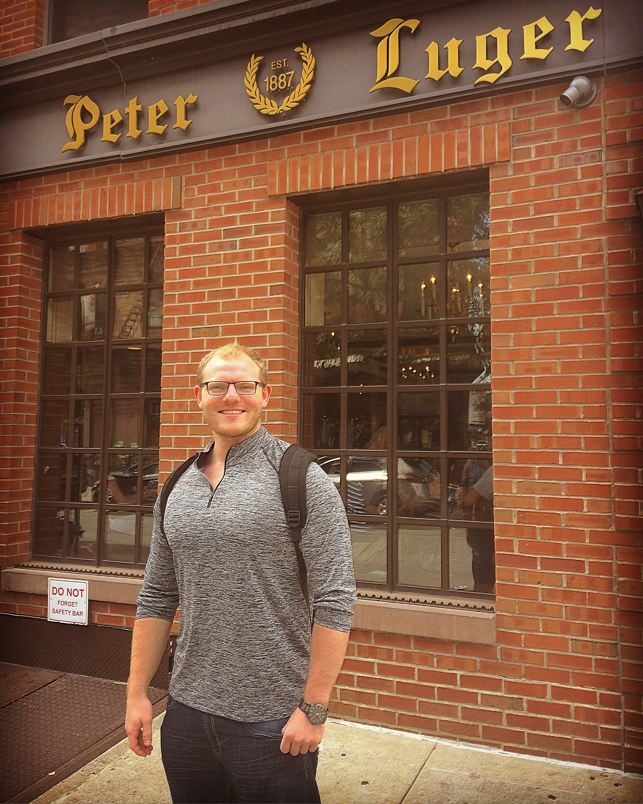

```{r knitr_init, echo=FALSE, cache=FALSE}
suppressWarnings(library(knitr))
suppressWarnings(library(rmdformats))
## Global options
options(max.print="75")
opts_chunk$set(echo=FALSE,
	             cache=TRUE,
              prompt=FALSE,
              tidy=TRUE,
              comment=NA,
              message=FALSE,
              warning=FALSE)
opts_knit$set(width=75)
```


<!-- Put a banner up at the top of the file that has all of the elements that we would like -->
<div class="banner" style="padding:7px; text-align:center>
<div class="banner-content">
<center>

<h1>Stats with Confidence</h1>
<p>*Got questions? With 99% confidence, we can help*</p>
<p> [Main Page](./index.html) | [Bios](./biography.html)
<!-- <a href="https://facebook.com" class="btn btn-primary">CLICK</a> -->
</center>
</div>
</div>

<!-- Beginning of the content -->

# Biography

Who's behind the madness of Stats With Confidence?

My name is Mark Kurzeja and I was a student at UofM who took Stats 250 in undergrad. I was a finance major and graduated with my BBA from Ross with minors in mathematics and computer science. I went to work in investment banking after graduation where I worked on a lot a lot of the products that blew up in 2008 (CLO's and Credit Derivatives) and then came back to UofM for my masters in Applied Statistics.

I've taught statistics on Coursera (Statistics with Python) and I was a Lead GSI for Stats 250 while in Grad School. I am currently working at Google as a Software Engineer and I am happy to talk about my past or experiences as well!

<!-- ========================= -->
<!-- Google Analytics Script -->
<!-- ========================= -->
<script> (function(i,s,o,g,r,a,m){ i['GoogleAnalyticsObject']=r; i[r]=i[r]||function(){(i[r].q=i[r].q||[]).push(arguments)}, i[r].l=1*new Date(); a=s.createElement(o),m=s.getElementsByTagName(o)[0]; a.async=1; a.src=g; m.parentNode.insertBefore(a,m) })(window,document,'script','//www.google-analytics.com/analytics.js','ga'); ga('create', 'UA-140003637-1', 'auto'); ga('send', 'pageview'); </script>


<!-- ========================= -->
<!-- This is where the footer goes! + Donation Button -->
<!-- ========================= -->
# Donations
<div class="w3-container w3-teal"; style="padding:8px; text-align:center; background-color:#F5F5F5">
<p> Like what you see? Want to help out the site? Have a special video request? Please Donate! <br> Venmo: `@MarkKurzeja`</p>
<form action="https://www.paypal.com/cgi-bin/webscr" method="post" target="_top">
<input type="hidden" name="cmd" value="_s-xclick" />
<input type="hidden" name="hosted_button_id" value="BGPHG2H4QHKFW" />
<input type="image" src="https://www.paypalobjects.com/en_US/i/btn/btn_donateCC_LG.gif" border="0" name="submit" title="PayPal - The safer, easier way to pay online!" alt="Donate with PayPal button" />

</form>
  <p>Copyright Mark Kurzeja 2019 | All Rights Reserved</p>
</div> 