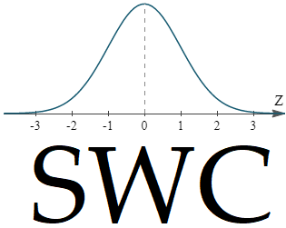
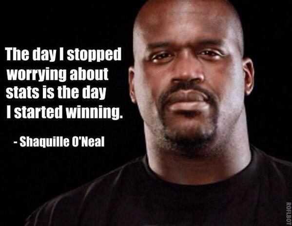

```{r knitr_init, echo=FALSE, cache=FALSE}
suppressWarnings(library(knitr))
suppressWarnings(library(rmdformats))
## Global options
options(max.print="75")
opts_chunk$set(echo=FALSE,
	             cache=TRUE,
              prompt=FALSE,
              tidy=TRUE,
              comment=NA,
              message=FALSE,
              warning=FALSE)
opts_knit$set(width=75)
```


<!-- Put a banner up at the top of the file that has all of the elements that we would like -->
<div class="banner" style="padding:7px; text-align:center>
<div class="banner-content">
<center>

<h1>Stats with Confidence</h1>
<p>*Got questions? With 99% confidence, we can help*</p>
<p> [Main Page](./index.html) | [Bios](./biography.html) </p>
<!-- <a href="https://facebook.com" class="btn btn-primary"> color = #FFFFFF Main Page</a> -->
</center>
</div>
</div>

<!-- Beginning of the content -->

# *Who We Are and What We Do*
It's Simple. You're in Stats 250. You're looking for some help. We are past instructors and GSIs to the course, looking to provide that help. [See our bios here!](./biography.html)

A lot of people have trouble with Stats 250 at the University of Michigan. The course is hard and sometimes there is a lot of work.  Stats with Confidence aims to make sure that you have everything that you need to do well in the course. 

Whether you are a B student looking to get an A in the course, a student looking to pass, or just a little lost, we want to get you to your goal.

From free resources to one-on-one and online tutoring, Stats with Confidence is here to help you do just one thing: Pass Stats with Confidence (99% confidence that is).

**Shaq agrees**

<center>

</center>


# *Contact Information*
 Fill out [**the form here**](https://docs.google.com/forms/d/e/1FAIpQLSen964ejZ8pAmJq0ktwgLRo1mRJ8HEC9od6aMHlecTn17uFWA/viewform) if you are interested in tutoring sessions. If you have any questions or comments, please feel free to reach out to us at [mark@statswithconfidence.com](mailto:mark@statswithconfidence.com). 
 
We prefer you use PayPal/Credit Card for all transactions, but our venmo is `@MarkKurzeja` because its the 21st Century!. *Always be sure to mention in the message a way to contact you and what service you are looking to pay for!!!*


# *Tutoring*

Sometimes, it helps to have a human in the room. We know this better than anyone, and are more than happy to help. Fill out [this quick form](https://docs.google.com/forms/d/e/1FAIpQLSen964ejZ8pAmJq0ktwgLRo1mRJ8HEC9od6aMHlecTn17uFWA/viewform) if you are interested in setting up a session!

We have four types of tutoring available: 

<!-- # ```{r, echo = F} -->
<!-- # knitr::kable(data.frame(Type = c("Local 1-1 Tutoring", "Group Local Tutoring", "1-1 Online Tutoring", "Group Online Tutoring"), Price = c("19.99 Per Session", "14.99 Per Session", "19.99 Per Session", "9.99 Per Session"))) -->
<!-- # ``` -->

```{r, echo = F}
library(magrittr)
library(knitr)
library(kableExtra)
dat <- data.frame(`Tutoring Type` = c(
  "Local 1-1",
  "Online 1-1",
  "Group Local Tutoring",
  "Group Online Tutoring",
  "Group Options"
  ),
  Description = c(
    "If you really feel best with some help in person, this is the most personalized option",
    "We can hop online and offer custom online help for any of your questions. This is the best option for late-night / tutoring that you never have to leave your home! ",
    "If you don't mind having up to five other students at the session with you, this is a great option for personal in-person tutoring",
    "The most economical, we host online multi-person group study sessions that will will get you ready for the exams. There can be quite a few students at these sessions, but if you are on a tight budget, this is the way to go!",
    "I know I said there are only four options, but if you have a few friends that would like to all jump in an online or in-person session together, we offer discounts for each person that joins!"
    ), check.names = F)

# Styling Options from KableExtra
  # kable(text_tbl) %>%
  # kable_styling(full_width = F) %>%
  # column_spec(1, bold = T, border_right = T) %>%
  # column_spec(2, width = "30em", background = "yellow")
# https://haozhu233.github.io/kableExtra/awesome_table_in_html.html
  
knitr::kable(dat) %>%
  kable_styling(full_width = F, position = "center") %>%
  column_spec(1, bold = T, border_right = T) %>%
  column_spec(2, width = "30em")
```

# *Exam Study Materials*
Looking for study materials and practice questions? Sign up for one of our tutoring sessions, and they are included for free!

# *Study Guides*

There are three exams in the course which comprise up to 80% of your grade so studying for them is the first priority. The first and the second exam study guide are free and the links for download are below. The final exam study guide is only $3.99 and is yours to keep. If you sign up for a tutoring session with us, the final exam one pager is free with your session! Email [mark@StatsWithConfidence.com](mailto:mark@StatsWithConfidence.com) if you have any questions!

* Click here to download: [First Exam Study Guide](https://github.com/MarkKurzeja/MarkKurzeja.github.io/raw/master/resources/first_exam_study_guide/Stats%20250%20First%20Exam%20One%20Pager.pdf) *This is still under construction*
* Click here to download: [Second Exam Study Guide](https://github.com/MarkKurzeja/MarkKurzeja.github.io/raw/master/resources/second_exam_study_guide/Stats%20250%20Second%20Exam%20One%20Pager.pdf) *This is still under construction*
* You can purchase the final exam study guide here: [Final Exam Study Guide](https://www.paypal.com/cgi-bin/webscr?cmd=_s-xclick&hosted_button_id=LAEV5FXPUPC2Y)

*If you use paypal, the download will begin as soon as you are done checking out. If you don't have a PayPal, we accept Venmo (`@MarkKurzeja`) because we know you're college kids just like us and that's easy too. If you pay via Venmo, I'll send it to you via email within 24 hours :)*


# *Helpful Videos*

Sometimes it is helpful to see something worked out. We get a lot of common questions. See if you can find your favorite topic here:

* [Type I and Type II Error Worked Out Example](https://youtu.be/Arwqw9ZOtIM)
* [Why Can we use a Normal Approximation to a Binomial Distribution](https://youtu.be/Arwqw9ZOtIM)
* [Distribution of Samples vs Distributions of Sample Means + CLT](https://youtu.be/9K3PK0TtLPg)

* Can't find your topic and think someone else might like it too? Email me at [mark@statswithconfidence.com](mailto:mark@statswithconfidence.com) and I can create it and post it for everyone!

# Live Demos to Play With

Seeing is believing. Look into the Central Limit Theorem, Type I and Type II Errors, and more! [Shiny Apps](https://markkurzeja.shinyapps.io/stats_250_demos/)

<!-- ## Labs & Lectures -->

<!-- Labs and Lectures can be difficult. While I don't have access to material for lectures for you, I do have my old lab slides which can be super helpful if you want to see the material a different way. You can find them below. -->


<!-- * [Lab 1 - Random Variables](https://www.example.com) -->
<!-- * [Lab 2 - Proportions](https://www.example.com) -->
<!-- * [Lab 3 - Binomial Distribution](https://www.example.com) -->
<!-- * [Lab 4 - Two Proportions](https://www.example.com) -->
<!-- * [Lab 5 - CLT](https://www.example.com) -->

<!-- ========================= -->
<!-- Google Analytics Script -->
<!-- ========================= -->
<script> (function(i,s,o,g,r,a,m){ i['GoogleAnalyticsObject']=r; i[r]=i[r]||function(){(i[r].q=i[r].q||[]).push(arguments)}, i[r].l=1*new Date(); a=s.createElement(o),m=s.getElementsByTagName(o)[0]; a.async=1; a.src=g; m.parentNode.insertBefore(a,m) })(window,document,'script','//www.google-analytics.com/analytics.js','ga'); ga('create', 'UA-140003637-1', 'auto'); ga('send', 'pageview'); </script>


<!-- ========================= -->
<!-- This is where the footer goes! + Donation Button -->
<!-- ========================= -->
# Donations
<div class="w3-container w3-teal"; style="padding:8px; text-align:center; background-color:#F5F5F5">
<p> Like what you see? Want to help out the site? Have a special video request? Please Donate! <br> Venmo: `@MarkKurzeja`</p>
<form action="https://www.paypal.com/cgi-bin/webscr" method="post" target="_top">
<input type="hidden" name="cmd" value="_s-xclick" />
<input type="hidden" name="hosted_button_id" value="BGPHG2H4QHKFW" />
<input type="image" src="https://www.paypalobjects.com/en_US/i/btn/btn_donateCC_LG.gif" border="0" name="submit" title="PayPal - The safer, easier way to pay online!" alt="Donate with PayPal button" />

</form>
  <p>Copyright Mark Kurzeja 2019 | All Rights Reserved</p>
</div> 